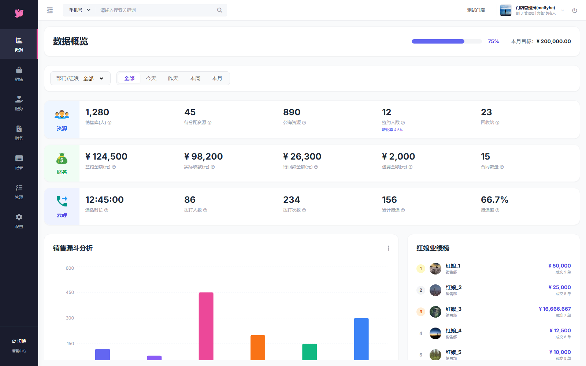
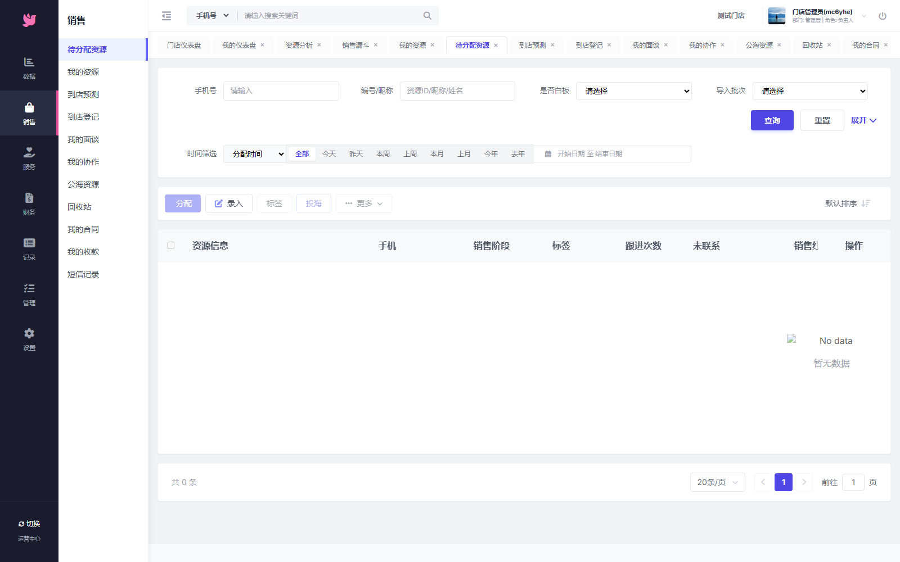
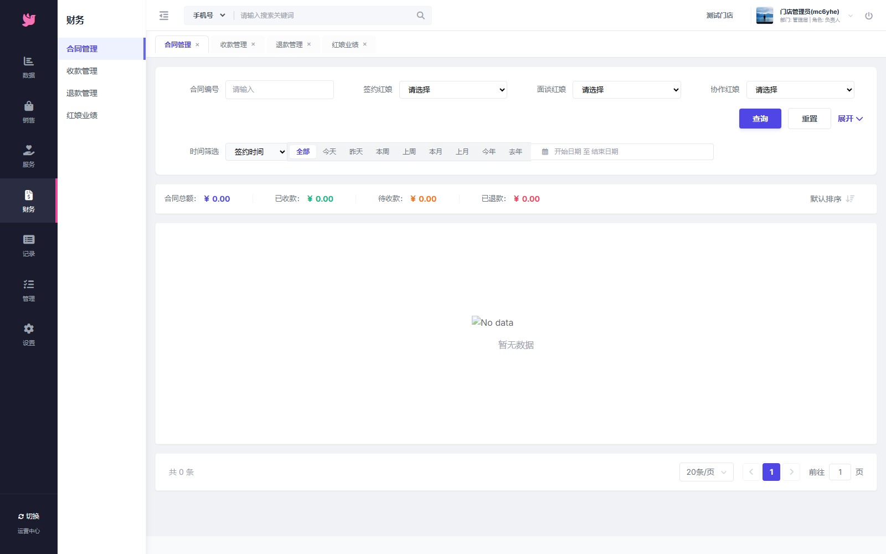
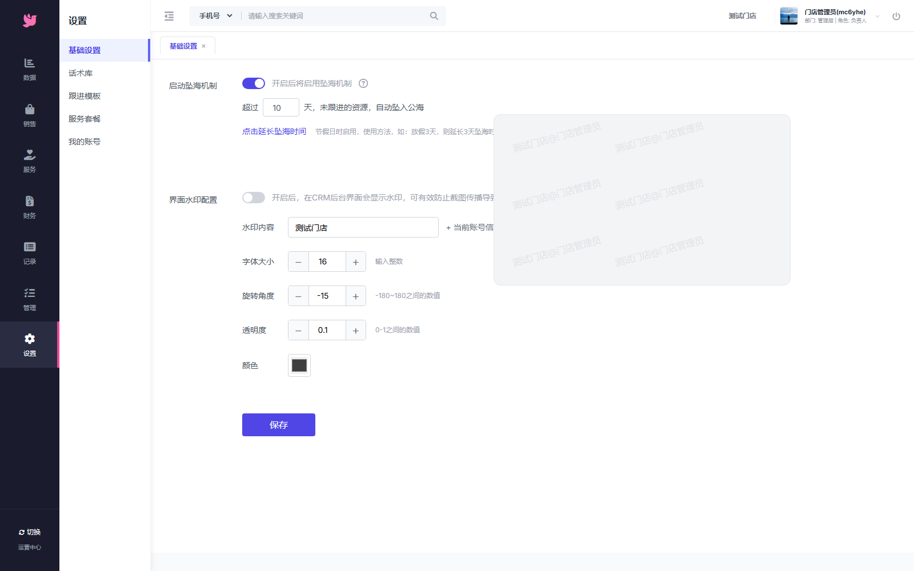

# Matchmaker CRM

一个给婚恋机构用的 CRM 前端工作台（React + Vite），可直接部署到 GitHub Pages。

---

## 项目预览

> 建议把下面几张图补上后，README 观感会立刻提升。

### 登录页


### 工作台首页（Dashboard）


### 资源管理


### 服务管理 / 财务管理


### 记录管理 / 系统设置


---

## 功能简介

- 客户资源管理：线索、状态、分配
- 服务流程管理：服务节点与跟进
- 财务管理：收支记录与统计视图
- 业务记录管理：操作留痕、查询追踪
- 系统管理：基础配置、权限相关页面

---

## 快速启动

```bash
npm install
npm run dev
```

---

## 构建静态站点

```bash
npm run build
```

构建产物在 `dist/`，可以直接托管为静态网页。

---

## 部署到 GitHub Pages

项目已配置：
- `vite.config.ts`（生产环境 base 默认 `/matchmaker-crm/`）
- `.github/workflows/deploy.yml`（推送 `main` 自动部署）

你只需要：
1. 推送代码到 GitHub 仓库
2. 打开 `Settings -> Pages`
3. Source 选择 **GitHub Actions**

部署成功后访问：
`https://<你的GitHub用户名>.github.io/matchmaker-crm/`

---

## 目录结构（简版）

```text
matchmaker-crm/
├─ components/
├─ docs/screenshots/      # README 里用的项目截图
├─ dist/                  # 构建后的静态产物
├─ App.tsx
├─ vite.config.ts
└─ .github/workflows/deploy.yml
```

---

## 补充说明

如果你的仓库名不是 `matchmaker-crm`，构建时改一下 base：

```powershell
$env:VITE_BASE_PATH='/你的仓库名/'; npm run build
```

（不改的话，GitHub Pages 可能出现资源 404。）
